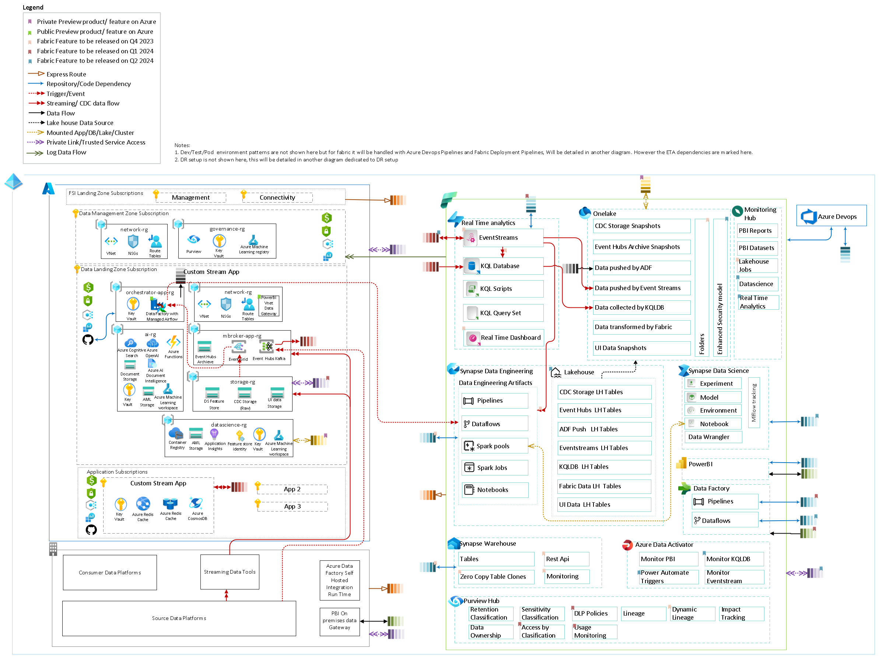
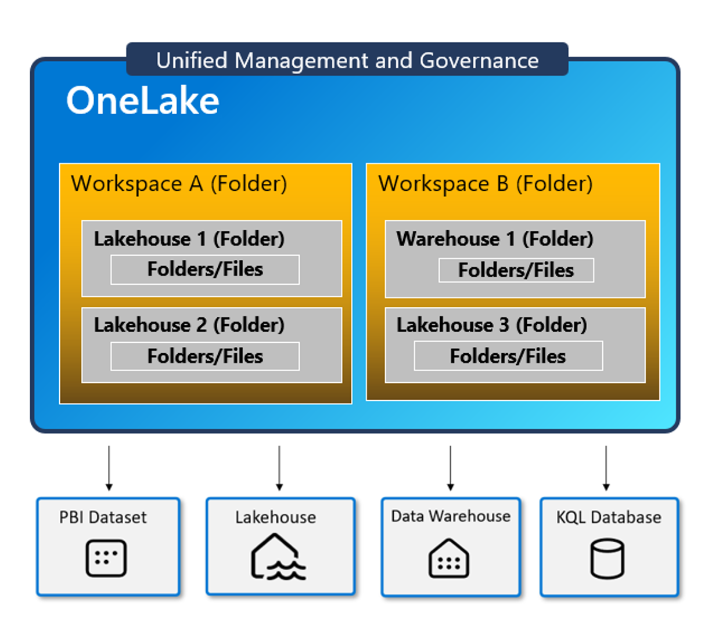
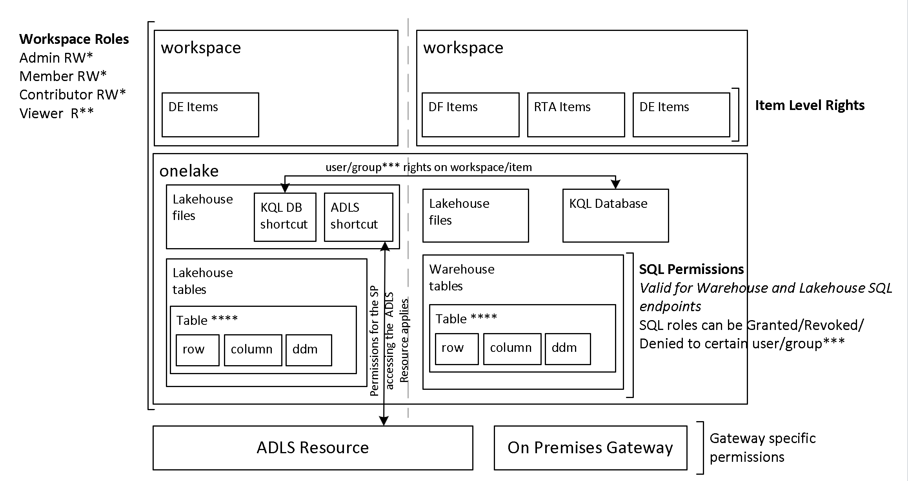
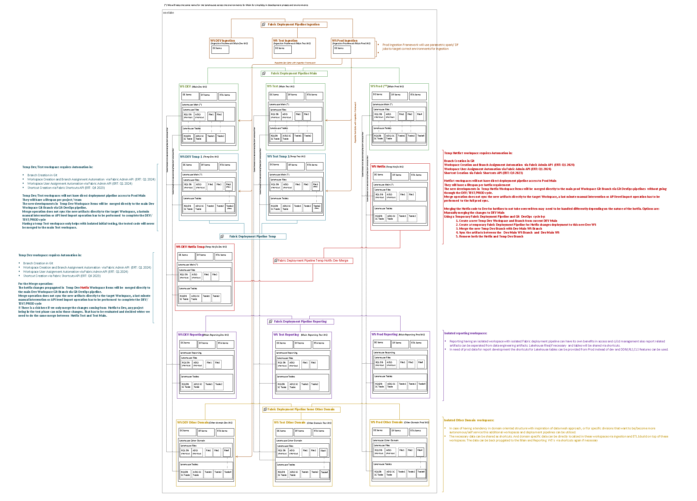

 # Microsoft Fabric

 
 
 *Complementary guidance for onboarding an enterprise to [Microsoft Fabric](https://learn.microsoft.com/fabric/get-started/microsoft-fabric-overview "MS Documentation for Microsoft Fabric")*

 Microsoft Fabric is an all-in-one analytics solution for enterprises that covers everything from data movement to data science, Real-Time Analytics, and business intelligence. It offers a comprehensive suite of services, including data lake, data engineering, and data integration, all in one place.


When onboarding an Enterprise with existing Data Infrastructures to a new SAAS platform like Fabric there are important topics that needs to be discussed like,

[1. How the integration with existing on premises and cloud infrastructure should look like?](#integration-with-existing-on-premises-and-cloud-infrastructure)
[2. How will be the Access Model?](#access-model)
[3. What should be the CI/CD approach?](#devops-cicd-approach)
[4. What should be the orchestration approach that combines the dependencies between all different new and existing data platforms](#orchestration-approach)
[5. What will be the adoption process and roadmap](#adoption-process)

In this repository we are aiming to provide some insights on how these decisions can be tackled.
the information shared in the repository bases on the state of Microsoft Fabric GA features and [publicly announced roadmap](https://learn.microsoft.com/fabric/release-plan/) as of 2023 December.

## Integration with existing on premises and cloud infrastructure 
 The evaluation for the needs for  Cloud infrastructure and on premises environment integration needs to be discussed primarily. Even though the enterprise may want to adopt Microsoft Fabric Without any existing Azure footprint, this is rarely a reality. Any existing Azure footprint that will feed and consume data to/from Microsoft Fabric should be evaluated from security(identity, networking) and governance perspective. Therefore an evaluation on [CAF (Cloud adoption framework) focusing on Enterprise Landing Zones](https://learn.microsoft.com/azure/cloud-adoption-framework/ready/landing-zone/) should be performed as a preliminary action, and necessary policy driven governance and network configuration actions should be taken. For FSI industry and similar industries with strong regulations the [FSI Landing Zones Principles](https://github.com/microsoft/industry/blob/main/fsi/referenceImplementation/readme.md) should be followed.

 Below you can find an example Architecture positioning diagram which covers how to integrate on premises and existing Azure Landscape with Microsoft Fabric.

 
 
# Access Model

Microsoft Fabric is purchased and enabled by capacity. Within a capacity you have one unified [OneLake](https://learn.microsoft.com/fabric/onelake/onelake-overview), and one to many workspaces. [Lakehouses](https://learn.microsoft.com/fabric/data-engineering/lakehouse-overview) in respective workspaces keeps the data in this single OneLake. you can isolate access and therefore environments within the same capacity by different workspaces.

 

The access model for variaous workspaces should be designed based on below access right grant and segregation possibilities:



\*  RW type WS roles are valid within their allowed activities, in every artifact covered by the specific workspace. 
   For more information refer to the [workspace roles section in documentation](https://learn.microsoft.com/fabric/get-started/roles-workspaces#-workspace-roles)

** Viewer WS role only covers Lakehouse tables and Warehouse tables/views , via SQL endpoint-TSQL interface, to have access to files the user/group needs to have either item level READ /READALL permission or a higher RW WS role.

***  users/groups mentioned in any part of the document are EntraID users/groups

**** 1. [ddm (dynamic data masking)](https://learn.microsoft.com/fabric/data-warehouse/dynamic-data-masking) applies only to the users/groups without Administrator, Member, or Contributor rights on the WS, and without elevated permissions on the Warehouse.


**** 2 . [Row level security](https://learn.microsoft.com/fabric/data-warehouse/row-level-security) only applies to Lakehouse SQL and Warehouse SQL endpoints, users/groups having elevated permissions on Lakehouse files will have access to all data. Row level security is applied with regular SQL RLS methods such as security policies and functions/predicates


**** 3 . [column-level security](https://learn.microsoft.com/fabric/data-warehouse/column-level-security) is applied  with the GRANT T-SQL statement for users/groups 

 # DevOps CI/CD approach

 Below diagram tries to address a possible CI/CD approach with how the lakehouse should be positioned within various environment types. Here it is suggested to use one git repository per environment vertical, like one repository for all dev, one repository for all test and one repository for prod. This approach bases on current available capabilities on Microsoft Fabric as of December 2023. the limitations and requirements taken into consideration are:

Requirements:
 1. The ability to have feature branches/workspaces on Dev environments
 2. The ability to have a Hotfix workspace for production
 3. Being able to back propagate hotfixes to respective prior stage environments to prevent those getting overwritten with future deployments
 4. Being able to have a backup on git for every stage.
 
 Limitations: 
 1. Fabric natively has only one tool to do promotion within environment stages called [Fabric Deployment Pipelines](https://learn.microsoft.com/fabric/cicd/deployment-pipelines/intro-to-deployment-pipelines).
 2. One workspace can only be referenced in one Fabric Deployment Pipeline
 3. One workspace can only be in sync with one git branch, there is no seamless switching between branches. When you switch you lose the artifacts that are not currently supported for git versioning.
 4. The syncing between the Workspace and and synced  git branch is not seamles and fully bidirectional. you need to commit the artifacts to be synced with git from workspace. if you externally commit an artifact to git, to be able to use it from workspace you need to import those via UI. There is selective commit from workspace to git but no selective import from git to workspace.




## Orchestration Approach
Most of the enterprises have not only one data platform and the data flowing between environments have complex dependencies. Therefore usually an external orchestrator is used and required to be used to manage inter-platform dependencies of pipelines. Microsoft Fabric, after GA announcement exposed API's that made possible to schedule jobs on-demand and follow outcomes. Since the API is still in preview, and does not yet support [Service Principle integration](https://learn.microsoft.com/rest/api/fabric/articles/using-fabric-apis#considerations-and-limitation), it is not yet possible to have a ConfidentialClient Application, therefore orchestration has to happen with public client approach. An app registration or a service user without mfa is be required to currently be able to do the execution.

Below you can find a sample python application flow with function definitions to
1. get an access token with necessary scopes
2. list items in the workspace
3. trigger a notebook as an on demand job
4. follow the status of the triggered on demand job to decide the next action

```python
import json
import time

# Fabric API and python request package has some sort of format incompatibility.
# the requests only works with http.client package
import http.client

# currently Fabric API does not support Service principle authentication, and the app user only  can access to the required scopes via msal  PublicClientApplication
# other methods like ConfidentialClientApplication with secret only works with default scope. user password authentication is not supported in MSAL.
# an alternative to this can be using a "service account user" created specifically for this purpose with azure.identity  UsernamePasswordCredential
from msal import PublicClientApplication


client_id = '3600de0a-932a-47bd-838e-9b1d45d8ec8c'
tenant_id = 'fd063604-ac53-4052-a584-76b05fcaede8'
scopes = [ 'https://api.fabric.microsoft.com/Workspace.ReadWrite.All', 'https://api.fabric.microsoft.com/Item.ReadWrite.All','https://api.fabric.microsoft.com/Item.Execute.All' ]
access_token = ''
refresh_token = ''

# function for acquiring token:
def _get_eid_token(client_id,tenant_id,scopes):
    app = PublicClientApplication(
    client_id = client_id,
    authority = "https://login.microsoftonline.com/" + tenant_id
    )
    acquire_tokens_result = app.acquire_token_interactive(
    scopes = scopes
    )
    access_token = acquire_tokens_result['access_token']
    refresh_token = acquire_tokens_result['refresh_token']
    print("access token : ", access_token)
    print("refresh token : ", refresh_token)
    return access_token,refresh_token

access_token,refresh_token = _get_eid_token(client_id,tenant_id,scopes)
# sample workspace id and notebook id.
# how to get these:
# 1. a notebook url in fabric workspace environment has below format:
#       https://app.fabric.microsoft.com/groups/{{workspace_id}}/synapsenotebooks/{{notebook_id}}?experience=data-engineering
# 2. Workspace ID can be found in Admin portal>workspaces>select workspace>click on details>id
workspace_id ='66bdca20-c152-49b3-9fbc-1f569069a4c5'
notebook_aid1= '36ffd3a0-c108-45bb-858b-dd7322cec945'
notebook_aid2= 'a35cf219-5edb-4156-b527-19ca3f5a13be'
# function for listing items in a workspace (not required for process, used to test if we can access to the workspace):
def _list_fabric_items(workspace_id,access_token):
    print("Running:_list_fabric_items ---------------")
    conn = http.client.HTTPSConnection("api.fabric.microsoft.com")
    payload = ''
    headers = {
        'Content-Type': 'application/json',
        'Authorization': 'Bearer '+access_token
    }

    print(headers)
    conn.request("GET", "/v1/workspaces/"+workspace_id+"/items", payload, headers)
    res = conn.getresponse()
    data = res.read()
    print(data.decode("utf-8"))
    
_list_fabric_items(workspace_id,access_token)

# function for triggering a notebook:
# reference docs:https://learn.microsoft.com/en-us/fabric/data-engineering/notebook-public-api
def _trigger_fabric_notebook(workspace_id,notebook_id,access_token):#,ti):
    print("Running:_trigger_fabric_notebook ---------------")
    # Pull the bearer token and use it to submit to REST API 
    conn = http.client.HTTPSConnection("api.fabric.microsoft.com")
    payload = json.dumps({
        "executionData": {}
        })
    headers = {
    'Content-Type': 'application/json',
    'Authorization': 'Bearer ' + access_token
        }
    conn.request("POST", "/v1/workspaces/"+workspace_id+"/items/"+notebook_id+"/jobs/instances?jobType=RunNotebook", payload, headers)
    res = conn.getresponse()
    status = res.status
    reason = res.reason
    location = res.getheader("Location")
    print("status:",status,"| reason:",reason, "| location", location, "plain response ", res.headers)
    return status, reason, location

# function for following status of a triggered notebook :    
def _follow_status_of_triggered_notebook(location,status, access_token):
    # location format:GET https://api.fabric.microsoft.com/v1/workspaces/{workspaceId}/items/{itemId}/jobs/instances/{jobInstanceId}
    # location example: https://wabi-west-europe-f-primary-redirect.analysis.windows.net/v1/workspaces/66bdca20-c152-49b3-9fbc-1f569069a4c5/items/36ffd3a0-c108-45bb-858b-dd7322cec945/jobs/instances/3e0196b9-005e-49b3-a2db-43700422eaa8
    print("Running:_follow_status_of_triggered_notebook ---------------")
    begin = sum([location.index("https://"),len("https://")])
    end = location.index("/v1/")

    connurl=location[begin:end]
    requrl=location[end:]
    conn = http.client.HTTPSConnection(connurl)
    payload = json.dumps({})
    headers = {
    'Content-Type': 'application/json',
    'Authorization': 'Bearer ' + access_token
        }

    while status not in ("Completed" ,"Failed"):
        conn.request("GET",requrl,payload , headers)
        res = conn.getresponse()
        data = json.loads(res.read())
        print(data)
        status=data['status']
        if status not in ("Completed" ,"Failed"):
            time.sleep(10)#api blocks very frequent queries
        reason=data['failureReason']
    return status,reason

# Below part is to simulate a DAG, since we cannot use these functions with currently available authentication method in airflow wrote a simple orchestration pattern

#Trigger first notebook
status, reason, location= _trigger_fabric_notebook(workspace_id,notebook_aid1,access_token)
if status==202 and reason.strip()=="Accepted":
    # start controlling the status
    # We need some delay for the submitted job to appear on location
    time.sleep(2)
    # We pass reason of the first request as status to the second:
    status,reason=_follow_status_of_triggered_notebook(location,reason, access_token)

    if status=="Completed":
        # trigger next job since the dependency i successful"
        status, reason, location= _trigger_fabric_notebook(workspace_id,notebook_aid2,access_token)
        if status==202 and reason.strip()=="Accepted":
            # We need some delay for the submitted job
            time.sleep(2)
            status,reason=_follow_status_of_triggered_notebook(location,reason, access_token)
            if status=="Completed":
                print("All jobs finished successfully")
            else:
                print(" Second job failed with status: "+str(status)+" and reason "+reason)
        else :
            print("initiation of the second job failed with status: "+str(status)+" and reason "+reason)
    else:
        print(" First job failed with status: "+str(status)+" and reason "+reason)
else :
    print("initiation of the  job failed with status: "+str(status)+" and reason "+reason)

```
Prerequisites for above application flow:
1. Right [scopes](https://learn.microsoft.com/rest/api/fabric/articles/scopes) has to be granted in [delegated permissions](https://learn.microsoft.com/entra/identity-platform/permissions-consent-overview) for the registered app. 
2. Above application opens an authentication window, which a delegation user needs to authenticate from. after the cookies are set a non-interactive silent flow can be used.
3. Microsoft fabric documentation only has a C# example for API integration, which utilizes MSAL, above python application also uses [MSAL python.](https://learn.microsoft.com/entra/msal/python/)

Above application can be utilized with minor changes to create, for example, an [AirFLow](https://airflow.apache.org/) DAG for orchestration purposes. Airflow currently does **not** have a [native operator support for Microsoft Fabric](https://airflow.apache.org/docs/apache-airflow-providers-microsoft-azure/stable/operators/index.html), but [python operators](https://airflow.apache.org/docs/apache-airflow/stable/howto/operator/python.html) can be utilized to accomplish this task.

# Adoption Process
To decide the phases of your adoption process there are several items you need to take into account. First you should look at the detailed adoption process roadmap in [Microsoft Fabric Documentation](https://learn.microsoft.com/power-bi/guidance/fabric-adoption-roadmap). Then analyze and decide the workloads that you want to start with and the timeline referencing the [Microsoft Fabric Feature Roadmap](https://learn.microsoft.com/fabric/release-plan/). Start working on wiring and plumbing, by focusing on  external platform dependencies like on premises access, other or Azure cloud access and other services. then plan your needs in CI/CD, Governance, Identity Access Management and Orchestration.


Note: This guidance will be updated in the future with future learnings and updates in the service.
All diagrams that are not taken from official Microsoft Fabric Documentation are shared in this [visio document.](media/diagram/FabricPositioningGeneric.vsdx)